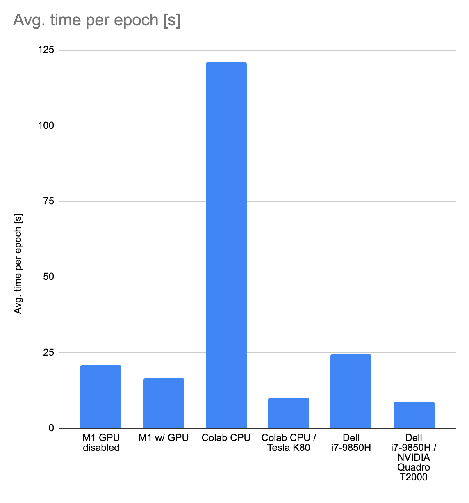

# Becnhmarking Tensorflow on Mac M1, Colab and Intel/NVIDIA

A simple test: one of the most basic Keras examples slightly modified to test the time per epoch and time per step in each of the following configurations. Results below.

- Macbook Air 2020 (Apple M1)
- Dell with Intel i7-9850H and NVIDIA Quadro T2000 
- Google Colab with Tesla K80 

## Code

(Jupyter notebook)[text_classification_from_scratch_for_benchmark.ipynb]

## Results:

Setup|Avg. time per epoch [s]|Avg. time per step [ms]
---|---|---
M1 GPU disabled|21|33.8|
M1 w/ GPU|16.6|26.4|
Colab CPU|120.8|192.6|
Colab CPU / Tesla K80|10|16|*averaged on 4 epochs since some initalization makes the 1st epoch take too long
Dell i7-9850H|24.4|39.2|
Dell i7-9850H / NVIDIA Quadro T2000|8.6|13.8|

